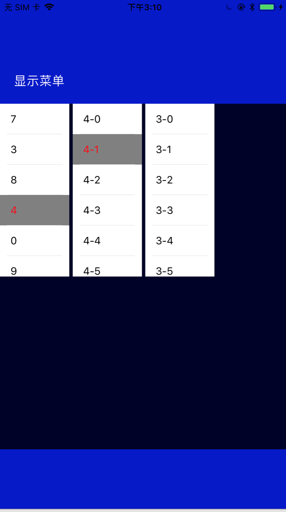

# SelectMenuView
iOS下拉菜单

## 效果图
 

## 代理说明

```Object-C

/**
 菜单块数

 @param selectMenuView 菜单view
 @return 块数
 */
- (NSInteger)numberOfSectionsInSelectMenuView:(WWSelectMenuView *)selectMenuView;


/**
 菜单某块的个数

 @param selectMenuView 菜单view
 @param section 第几块
 @return 个数
 */
- (NSInteger)selectMenuView:(WWSelectMenuView *)selectMenuView numberOfRowsInSection:(NSInteger)section;


/**
 获取数据

 @param selectMenuView 菜单view
 @param section 菜单块
 @param row 某块的位置
 @return 数据
 */
-(NSString *)selectMenuView:(WWSelectMenuView *)selectMenuView section:(NSInteger)section row:(NSInteger)row;


/**
 菜单选择
 
 @param selectMenuView 菜单view
 @param section 第几块
 @param row 选择的位置
 */
- (void)selectMenuView:(WWSelectMenuView *)selectMenuView section:(NSInteger)section didSelect:(NSInteger)row;


/**
 菜单完成
 
 @param selectMenuView 菜单view
 @param selectIndexs 选中的位置数组
 */
- (void)selectMenuView:(WWSelectMenuView *)selectMenuView finish:(NSArray<NSNumber *> *)selectIndexs;
```